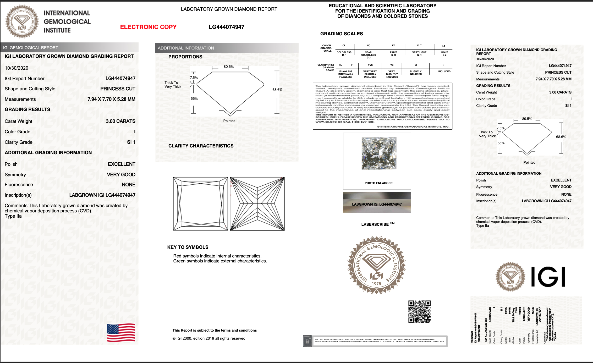
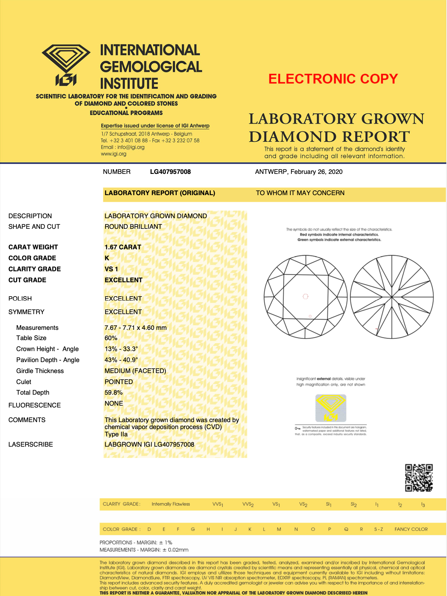

## About
Extract info from IGI's pdf certificate
Currently working with two types of certificate, ideally would like to add a lot of features.

## Project
1. Gets all PDF from a folder
2. Reads them one by one and gets important fields
3. Saves in 'Master' csv

## Types of Certificate it works with

## Unfulfilled 
- [ ] Faced problems when report format was updated in 2021
- [ ] Even in Type 1, not all length of fields were consistent; which messes up data extraction & uniformity
- [ ] Should have used list indexs to get the data
- [ ] Manually replaced / changed data to get required fields